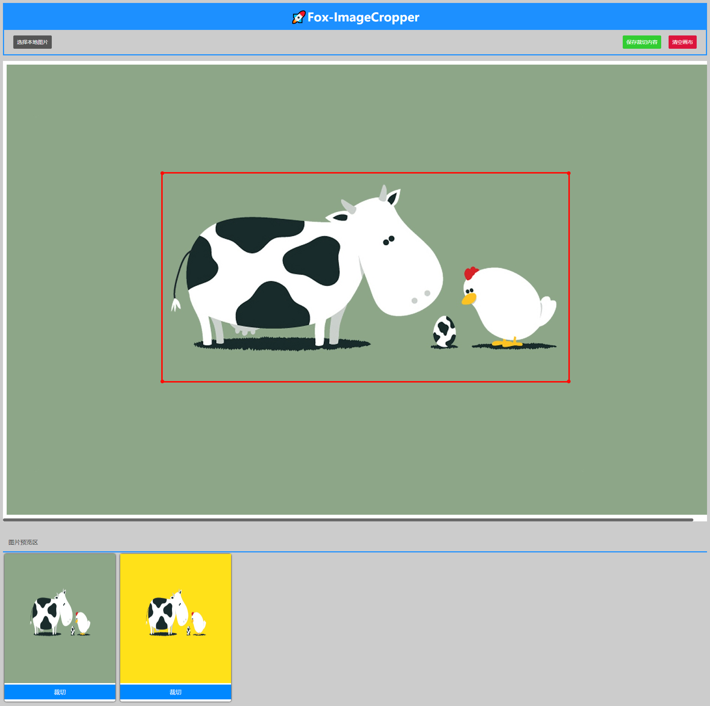

# 🚀 Fox-ImageCropper

> ImageCropper Tool, basci image processor base on canvas
> 基于Cavnas的图片裁切工具，基础图片处理工具

> **Tips 1:** 还处于开发流程中，功能暂时不完善，没有部署到线上， 你可以暂时 `git clone` 到本地运行
> **Tips 2:** 仓库中的dist文件为打包后的代码，clone后请重新打包
> [预览地址（功能不完善，持续更新中····）](https://forrestyuan.github.io/Fox-ImageCropper/dist) 
>
> 如果你喜欢，觉得有一点儿价值，不妨给个 **💗Star** 或者 **🔗Fork**到你的仓库一起完善，发现代码上有bug或需要完善的，想你提个**✍Issue**一起探讨完善，能 **🙋PR** 一下我就更😘你啦！

## 🚴运行：

项目基于webpack构建。
```bash
# 打包代码
npm run build
```

```bash
#运行代码
npm run start
```
☞ 打包后的dist 文件里的html可以直接在浏览器中查看！

## 📁 目录结构

```
dist //打包后文件
 |
src //存放源码文件
 |—— css //样式文件
 |    |—— cropper.css
 |    |—— img.css
 |    |__ index.css
 |——— js  //脚本文件
 |    |—— cropper.js //画布、裁切器相关处理
 |    |—— img.js  //图片处理相关
 |    |—— resizeBox.js //封装改变容器宽高
 |    |—— util.js //辅助工具方法
 |    |__ index.js //应用入口js
 |—— index.html //webpack页面模板
.gitignore
 |
LICENESE
 |
package.json
 |
package.lock.json
 |
README.md
 |
webpack.config.js
 |
previewEffect.png //预览效果图（与项目无关）

```
## 🔎预览效果（持续更新中·····）
> 查看预览图 或者 [预览地址（功能不完善，持续更新中····）](https://forrestyuan.github.io/Fox-ImageCropper/dist) 


## 📃 License

### [MIT License](https://github.com/forrestyuan/Fox-ImageCropper/blob/master/LICENSE)
Copyright (c) 2019 ForrrestYuan
